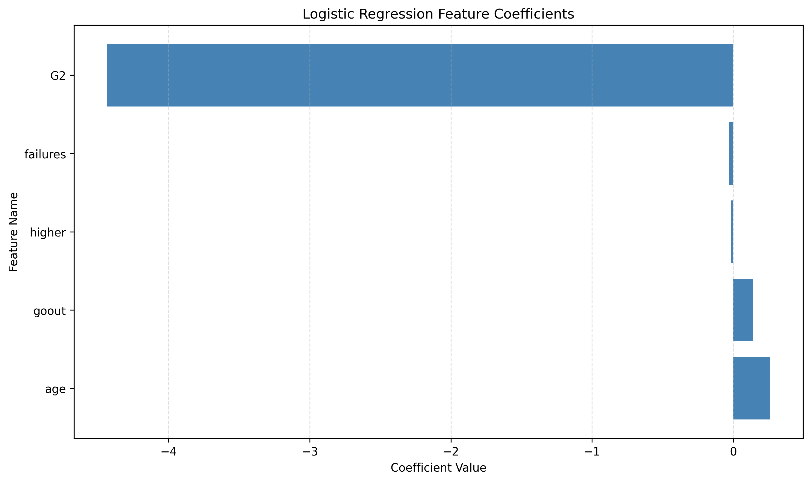
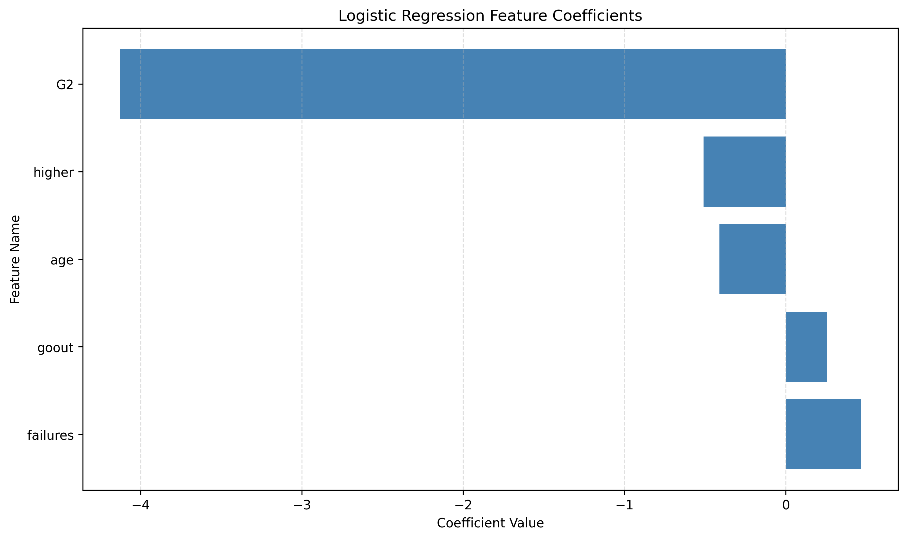
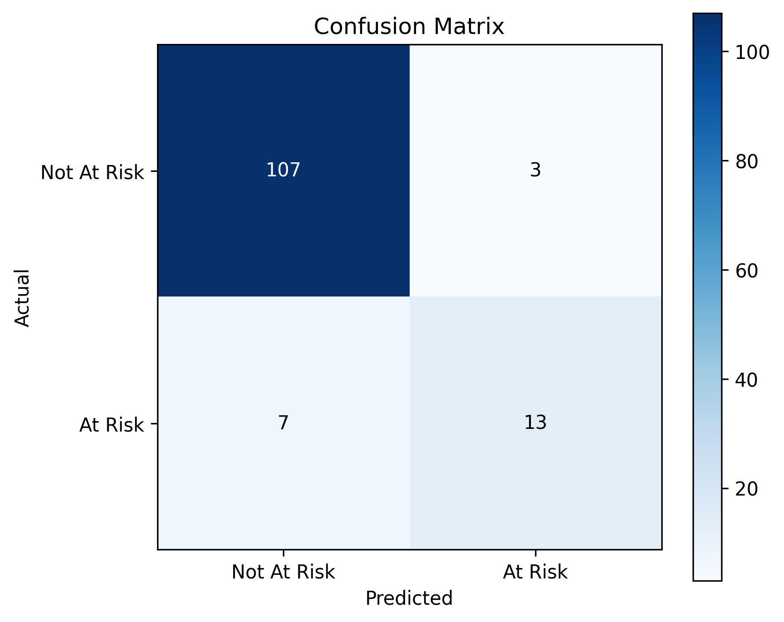
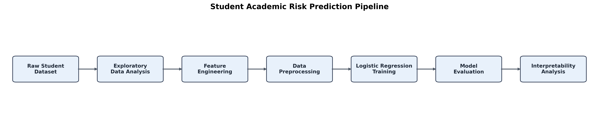

# Interpretability-Aware Student Academic Risk Prediction

An interpretability-focused machine learning project for academic risk prediction and behavioral pattern analysis across student performance datasets.

## Problem Statement

Academic institutions often struggle to identify students who are at risk of poor academic performance early enough for effective intervention. Traditional approaches rely heavily on manual monitoring and final examination outcomes, limiting the ability to provide timely academic support.

This project aims to build a data-driven system that predicts whether a student is academically at risk using historical academic and behavioral information. The objective is not only to achieve strong predictive performance, but also to generate interpretable insights that can support early intervention strategies.

---

## Project Objective

The objective of this project is to develop a supervised learning system capable of classifying students as:

- **At Risk**
- **Not At Risk**

based on academic performance indicators, behavioral characteristics, and socio-educational factors.

The system is designed to:

- Identify students likely to underperform academically
- Analyze meaningful contributors to academic risk
- Support data-driven educational intervention strategies
- Prioritize interpretability and defensible modeling decisions

---

## Prediction Target

The target variable for this project is a binary classification label:

- **At Risk (1):** Student likely to score below the academic threshold
- **Not At Risk (0):** Student expected to meet or exceed the threshold

The target label is derived from final academic performance (`G3`) to simulate a realistic academic evaluation scenario.

---

## Machine Learning Formulation

This problem is formulated as a supervised binary classification task.

Historical student records with known academic outcomes are used to train machine learning models that learn patterns associated with academic risk.

Supervised learning is appropriate because:

- Labeled outcome data is available
- The objective is to predict a discrete category
- Performance can be evaluated using standard classification metrics

---

## Modeling Approach

This project follows an interpretability-first machine learning strategy.

Instead of immediately applying complex ensemble models, Logistic Regression was intentionally selected as the baseline model to:

- Interpret feature coefficients directly
- Validate exploratory data analysis findings
- Detect multicollinearity and unstable feature behavior
- Study feature redundancy and coefficient dominance
- Prioritize transparency and defensibility over raw predictive performance

Multiple experimental feature configurations were evaluated to study the tradeoff between predictive accuracy and interpretability.

---

## Project Scope and Assumptions

- The model focuses on academic and behavioral attributes available during the academic term
- The system is designed for early academic risk identification, not final academic judgment
- The project does not aim to replace human decision-making, but to support it
- The analysis identifies statistical associations rather than causal relationships

---

## Dataset Description

This project uses the **Student Performance Dataset** from the UCI Machine Learning Repository.

Dataset Source:
https://archive.ics.uci.edu/ml/datasets/Student+Performance

The dataset contains academic, demographic, family, and behavioral attributes of secondary school students.

Key features include:

- Prior academic grades
- Number of past failures
- Study time
- Social activity
- Family support indicators
- Educational aspirations
- Absences

Two subject datasets were evaluated:

- Mathematics Performance Dataset
- Portuguese Language Performance Dataset

---

## Target Variable Definition

The target variable `at_risk` is derived from the final grade (`G3`):

- **at_risk = 1:** `G3 < 10`
- **at_risk = 0:** `G3 ≥ 10`

This formulation reflects a realistic academic risk identification setting.

---

## Key Results

### Final Baseline Logistic Regression Model

| Metric | Value |
|---|---|
| Accuracy | 92.41% |
| Precision (at_risk) | 92% |
| Recall (at_risk) | 85% |
| F1-Score (at_risk) | 88% |

### Key Insights

- `G2` emerged as the strongest direct predictor of academic risk
- Behavioral features such as `goout` retained meaningful predictive influence
- Historical academic failures showed strong exploratory relationships but partial redundancy with `G2`
- Several intuitive variables demonstrated reverse causality or unstable coefficient behavior during Logistic Regression interpretation
- The project prioritized interpretability and feature stability rather than optimizing raw predictive accuracy alone

---

## Cross-Subject Generalization Analysis

The same preprocessing, feature engineering, and modeling pipeline was evaluated on both:

- Mathematics performance dataset
- Portuguese language performance dataset

This experiment was conducted to study whether predictive and interpretability patterns remain stable across academic subjects.

### Comparative Performance

| Dataset | Accuracy | Recall (at_risk) |
|---|---|---|
| Mathematics | 92.41% | 85% |
| Portuguese | 92.31% | 65% |

### Stable Cross-Subject Findings

Several feature behaviors remained consistent across both subjects:

- `G2` remained the strongest direct predictor of academic risk
- `goout` consistently showed positive association with academic risk
- `higher` acted as a protective factor in both datasets

### Subject-Specific Variability

Some features exhibited differing behavior across subjects:

- `failures` retained stronger independent influence in the Portuguese dataset
- `age` demonstrated directional instability across datasets

These observations reinforced the importance of coefficient-level interpretation and cross-dataset validation rather than relying solely on predictive accuracy.

---

## Visualizations

### Mathematics Dataset Feature Coefficients



### Portuguese Dataset Feature Coefficients



---

### Confusion Matrix



---

### Project Pipeline



---

## Final Conclusions

This project demonstrated that interpretable machine learning can effectively identify meaningful academic risk patterns while maintaining strong predictive performance.

Across both Mathematics and Portuguese student datasets:

- Current academic performance (`G2`) consistently emerged as the strongest predictor of academic risk
- Behavioral variables such as social activity (`goout`) retained stable predictive influence
- Cross-subject validation revealed both stable and subject-specific feature behavior

The project also highlighted the importance of:

- Coefficient-level interpretation
- Multicollinearity analysis
- Feature stability validation
- Reverse causality awareness
- Cross-dataset experimentation

Rather than optimizing exclusively for predictive accuracy, the project prioritized transparency, interpretability, and defensible modeling decisions.

---

## Limitations

This project intentionally prioritizes interpretability and methodological transparency over maximizing predictive performance.

Several limitations should be considered:

- The dataset size is relatively small, limiting statistical generalization
- The target variable is derived from final grades rather than long-term educational outcomes
- Behavioral and socio-economic variables may contain hidden confounding factors
- Logistic Regression assumes linear relationships between predictors and risk probability
- The analysis identifies associations rather than causal relationships

These limitations reinforce the importance of cautious interpretation when applying predictive models in educational settings.

---

## Future Improvements

Potential future extensions include:

- Threshold optimization for recall-sensitive intervention systems
- Comparison with tree-based ensemble models
- Temporal academic performance modeling
- Explainability using SHAP or LIME
- Institutional intervention simulation studies

---

## Skills Demonstrated

- Supervised Machine Learning
- Logistic Regression
- Feature Engineering
- Exploratory Data Analysis
- Multivariate Analysis
- Model Interpretability
- Cross-Dataset Validation
- Data Visualization
- Python
- Pandas
- Scikit-learn
- Statistical Reasoning


## Project Structure

```text
student-risk-prediction/
├── data/
│   ├── raw/
├── notebooks/
│   └── exploratory_analysis.ipynb
├── src/
│   ├── data_preprocessing.py
│   ├── feature_engineering.py
│   ├── train_models.py
│   └── evaluate_models.py
├── results/
│   ├── figures/
│   └── metrics/
├── main.py
├── requirements.txt
└── README.md
```

## Installation

1. Clone the repository
2. Install dependencies:
```bash
python -m venv .venv
source .venv/bin/activate   # or .venv\Scripts\activate on Windows
pip install -r requirements.txt
```

## Usage

Run the main script to preprocess data, train models, and evaluate performance:
```bash
python main.py
```

## Requirements

- Python 3.8+
- See requirements.txt for detailed dependencies

## Author

Ch. Mukhesh Kumar
B.Tech Computer Science & Engineering

## License

MIT License
